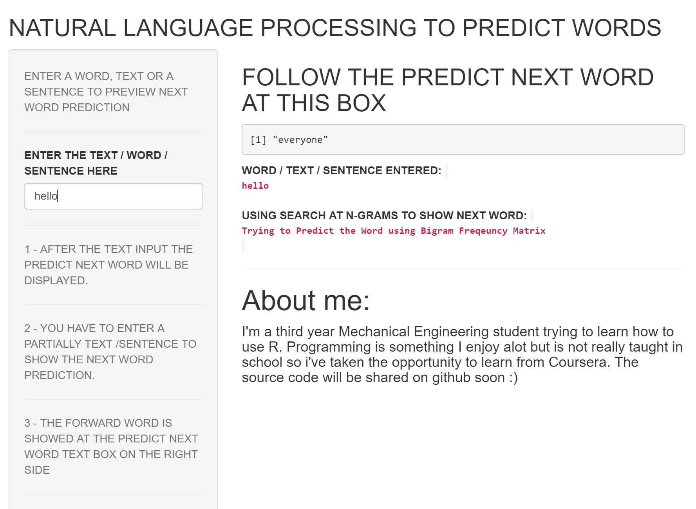

Overview
========================================================

- The objective of this project is to develop a shiny app that can predict the next wordk
- The data came from [HC Corpora](http://www.corpora.heliohost.org) with three files (Blogs, News and Twitter). The data was cleaned, processed, tokenized, and n-grams are created.

Methods of approaching
========================================================
- First the data was loaded and then analysed. Then a subset of the data was created which includes 10,000 lines from blogs, news and twitter text files. The text data was cleaned by removing numbers, punctuation, profanity, URLs and converted to lower case.

- The sample text was "tokenized" into n-grams to construct the predictive models. An example of an N-gram would be a BiGram where it is a contiguous sequence of n items from a given sequence of text).

- The n-grams files or data.frames (unigram, bigram, trigram and quadgram) are matrices with frequencies of words, used into the algorithm to predict the next word based on the text entered by the user.
 
The Shiny App
========================================================
- The shiny application predicts the next possible word after the users input.
- The predicted word is obtained from the n-grams matrices, comparing it with tokenized frequency of 2, 3 and 4 grams sequences.

The App user interface
========================================================
{width=800px}

